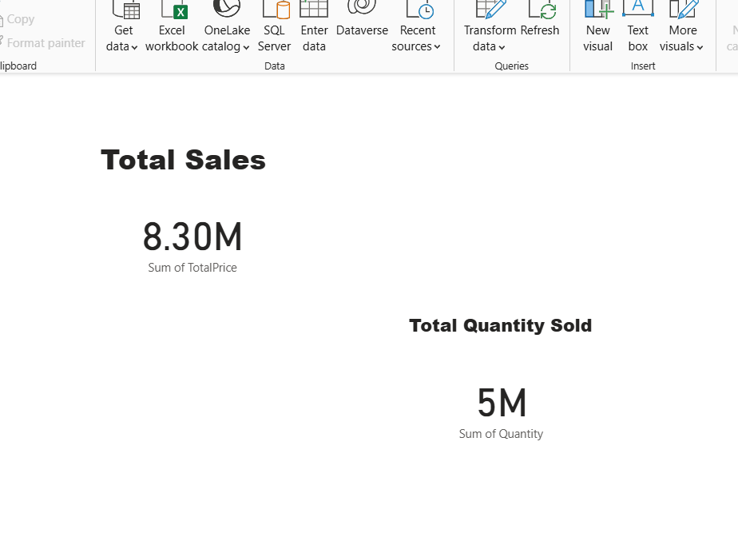
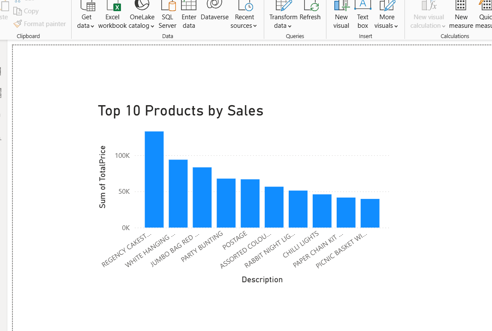

# Cloud-Based-End-to-End-ETL-Pipeline-for-Sales-Data-
Engineered an ETL pipeline using Python, AWS S3, Redshift and Power BI for scalable sales data processing. 

## Power BI Dashboard Preview

### Total Sales KPI

### 📈 Sales by Category

